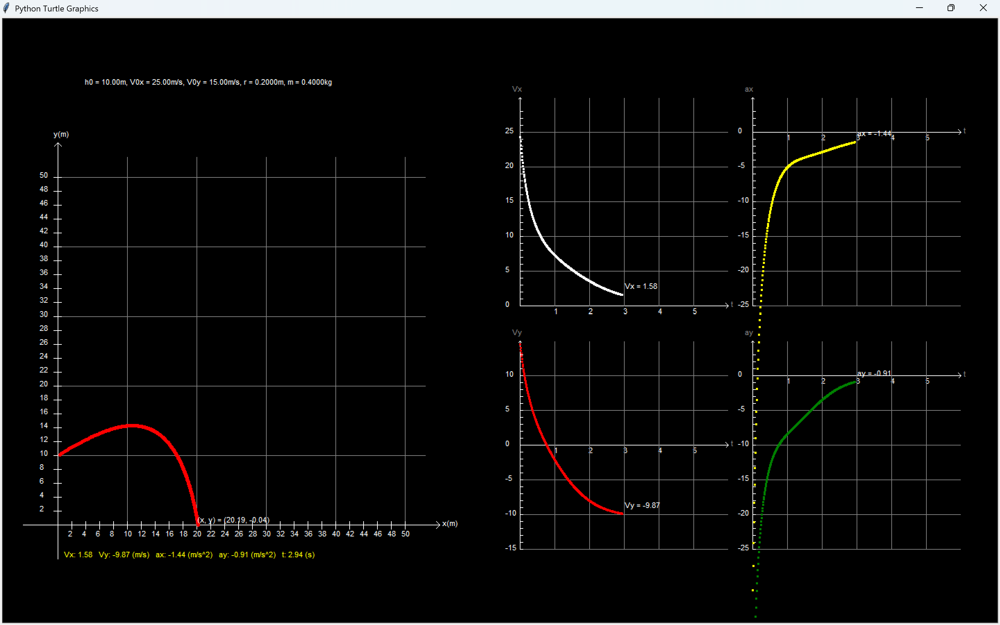
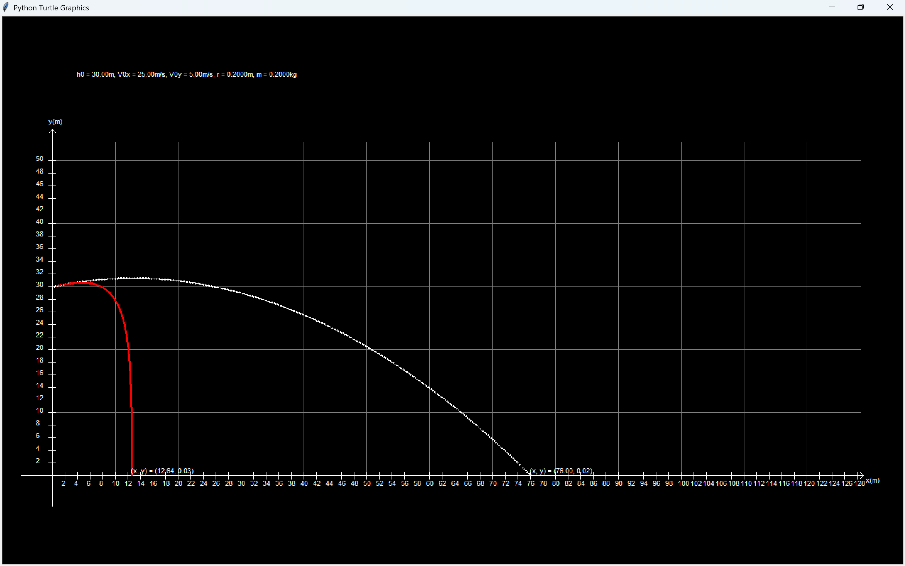

# Projectile Motion with Air Resistance

A Python-based simulation of projectile motion with air resistance, implemented using the Euler method to compute real-time dynamics and visualize trajectories with the Turtle graphics module.

---

##  Overview: Project 1 - Projectile Simulation

### Overview

This project calculates and simulates the trajectory of a projectile using user-defined parameters,
and visualizes the results through graphs and graphical representations.

### Features

- Visualizes real-time projectile trajectory  
- Displays velocity–time (v–t) and acceleration–time (a–t) graphs  
- Supports both x and y directional analysis  

### Results

### Source Code

[View Source Code](./projectile_simulation.py)

---

## Overview: Project 2 - Projectile Comparison (With and Without Air Resistance)

### Overview

This project compares two projectile motion simulations: one with air resistance and one without (ideal motion).
It visualizes both trajectories to illustrate the differences using graphical representations.

### Features

- Visualizes two real-time projectile trajectories (with and without air resistance)
- Displays both trajectories on the same graph for direct comparison

### Results

### Source Code

[View Source Code](./projectile_comparison.py)
